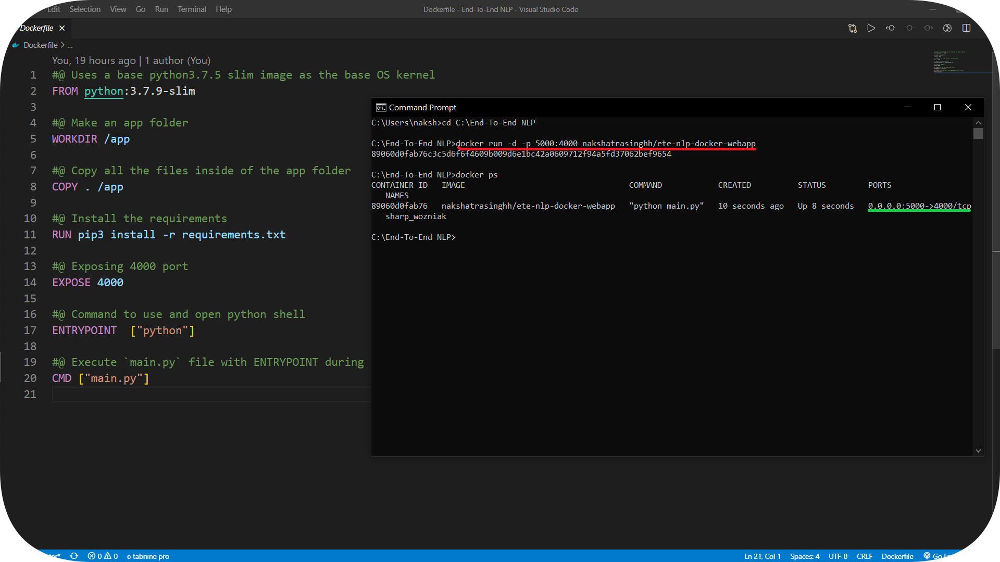
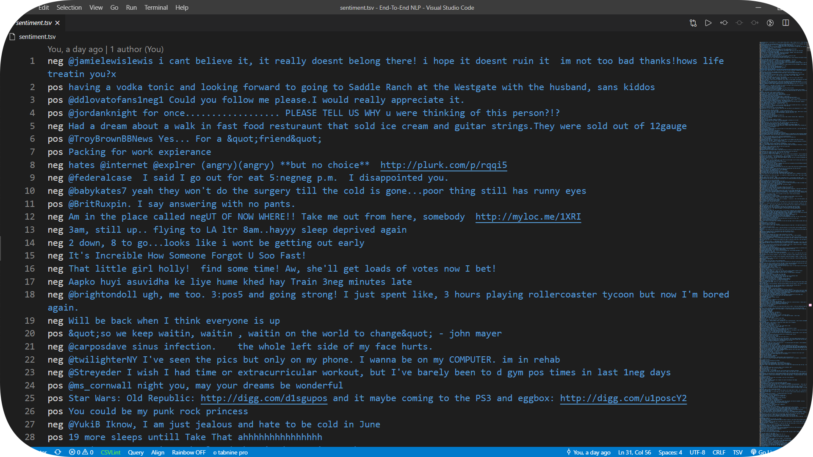
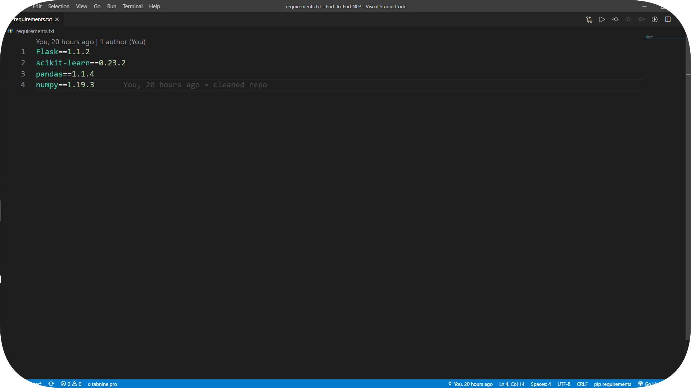
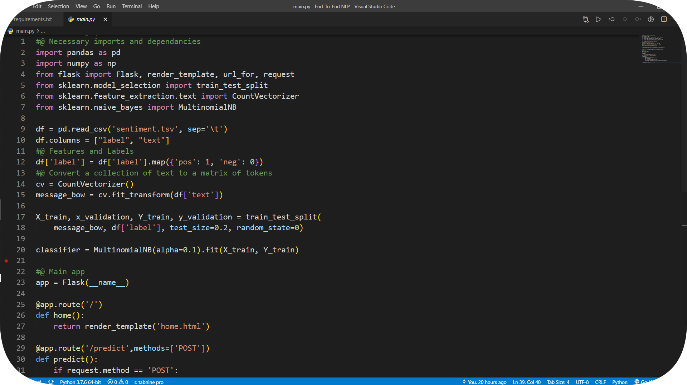
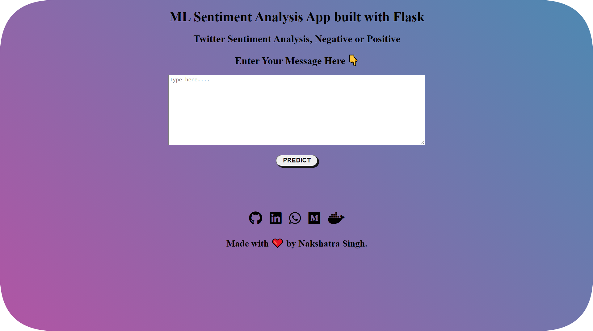
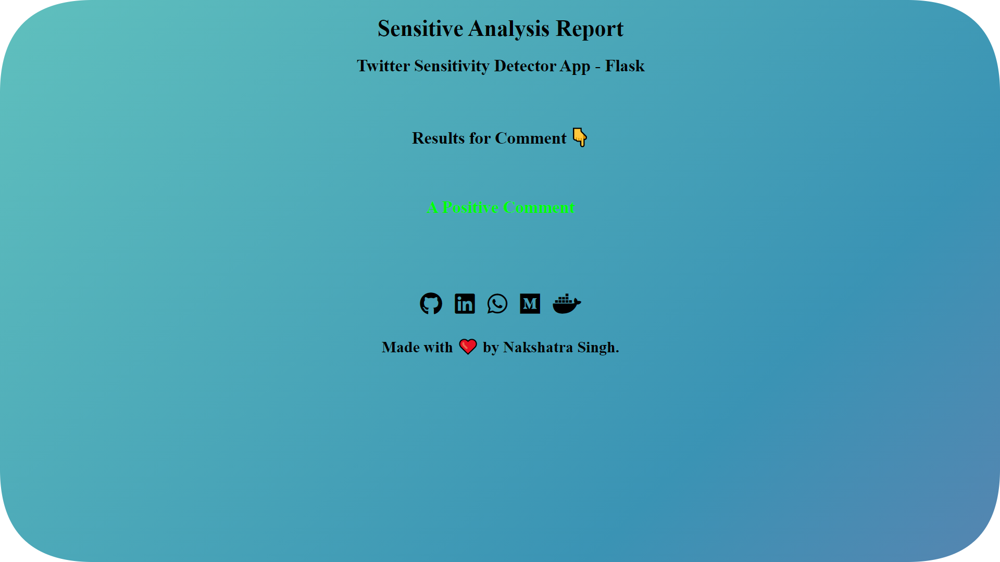
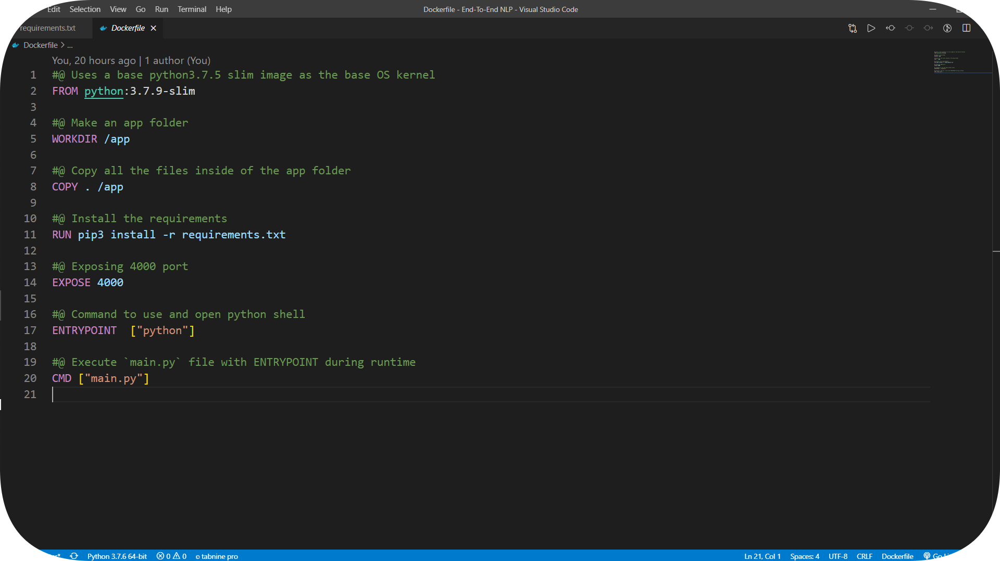
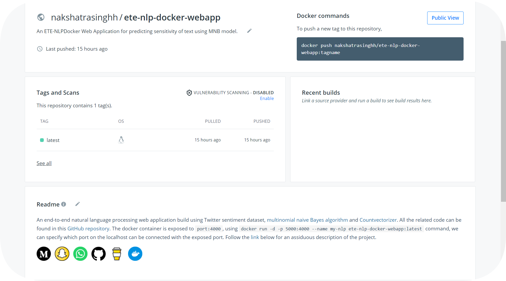

# ETE Natural Language Processing- Docker🐳

End-to-end Natural Language Processing WebApp build using Flask and deployed as an image on [DockerHub](https://hub.docker.com/r/nakshatrasinghh/ete-nlp-docker-webapp). A docker image as a web application which predicts the sensitivity of text (negative or positive) using multinomial naive bayes algorithm and countvectorizer. The `random state` parameter has been set to a constant, so that the model doesn't undergo **underspecification** during deployement stage. Green command to be executed to run the image directly in any local machine and red is the output after running the image (detached mode). The image is in it's own `docker isolated network`, for our application to talk to the backend we must specify on which port will the `requests hit the application (port:5000)` and which port the `application listens to (exposed as 4000, can't be changed during runtime).` 



## Dataset

For this project, I have used the Twitter sentiment dataset. It consists of 2000 rows and 2 columns. It's a relatively small dataset which makes it portable across different computers. The target column has 2 unique values, pos and neg. The other column has textual data. *On the side note, I used the [Rainbow CSV extension](https://marketplace.visualstudio.com/items?itemName=mechatroner.rainbow-csv) for VS-code to make .csv files look more attractive 😅*. The dataset can be viewed [here](https://github.com/nakshatrasinghh/ETE-NLPDocker/blob/master/sentiment.tsv).

 

## Requirements & Training script



⚠️ All the necessary [packages](https://github.com/nakshatrasinghh/ETE-NLPDocker/blob/master/requirements.txt) must be installed using pip in order to run the application. ⚠️ Multinomial naive bayes algorithm was used to train the model. Countvectorizer was used to increase the dimensions of the feature matrix. Flask app and training script are in one python file, making the code more readable. Detailed code of the Flask app and training script [here](https://github.com/nakshatrasinghh/ETE-NLPDocker/blob/master/main.py).



## Web Application

The web application was build using inline html styling and rendered using [flask utility functions](https://flask.palletsprojects.com/en/1.1.x/api/#flask.render_template). By clicking on predict, the application will predict whether the comment is a negative or positive comment. Along the footer, I have added all my social icons using [fontawesome js](https://kit.fontawesome.com/5f3f547070.js) kit. HTML-css inlined code for home and result pages can be found [here](https://github.com/nakshatrasinghh/ETE-NLPDocker/tree/master/templates).





## Dockerfile

To create docker images and run them in containers, you need to have a [dockerfile](https://github.com/nakshatrasinghh/ETE-NLPDocker/blob/master/Dockerfile) which includes all the commands to be executed sequential for the application to run in the base OS kernel (in this case, Ubuntu). Firstly, we'll use a basic linux OS kernel with [python 3.7.9](https://hub.docker.com/_/python) (keeps the image size small and very portable across different computers). 

⚠️***This is the defacto image. If you are unsure about what your needs are, you probably want to use this one. It is designed to be used both as a throw away container (mount your source code and start the container to start your app), as well as the base to build other images.*** ⚠️



Secondly, we'll make an app directory where all our code will be saved, move to the app directory, then copy all the project files in the app directory, and pip install all the requirements. Finally, we expose the port as 4000 for the docker container to communicate with the app using localhost and execute python3 command along with the file we need to execute for that application to run.  

## Docker Commands

**```docker build -t ete-nlp-docker-webapp:latest . ```**

Docker [build command](https://docs.docker.com/engine/reference/commandline/build/) will build the docker image for us, `docker build -t <image-name>:<tag> .`, here -t stands for tag. Tag is used to version the docker images in deployement phase. The  default tag is latest. **Make sure you are in the working directory of the project.**

**```docker run -d -p 5000:4000 --name my-nlp ete-nlp-docker-webapp:latest```**

Docker [run command](https://docs.docker.com/engine/reference/commandline/run/) will run the docker image in a docker container for us, `docker build --name <container-name>:<tag> .`, here --name stands to container name, -d stands for detached mode and -p stands for port. Here, 5000 is the localhost port and 4000 is the docker network port. We are connecting the 5000-4000 port for the app to communicate with the backend. 

**```docker commit <container-id> <dockerhub-username>/<repo-name>```**

Docker [commit command](https://docs.docker.com/engine/reference/commandline/commit/) will commit the the unstaged changed and prepare the changes to be pushed in docker hub repositories. 

**```docker login```**

Docker [login command](https://docs.docker.com/engine/reference/commandline/login/) will setup the credentials to log in to a Docker registry.

**```docker push <newly-created-image-name>```**

Docker [push command](https://docs.docker.com/engine/reference/commandline/push/) will push the staged changes to docker cloud.



## Docker Hub
Click the icon below to checkout the docker registry, just execute **`docker run -d -p 5000:4000 nakshatrasinghh/ete-nlp-docker-webapp`** on cmd, the application will run on **`localhost:5000`**. After running the image, open a chrome tab, and type **`localhost:5000`**. Your application is ready to use, without downloading any dependencies, you can run an end-to-end web application. Make sure you have [docker](https://hub.docker.com/editions/community/docker-ce-desktop-windows/) installed, that's the only thing you'll need to run the application in your local workspace.

<p align='left'>
  <a href="https://hub.docker.com/repository/docker/nakshatrasinghh/ete-nlp-docker-webapp"></a>&nbsp;&nbsp;
 </p>

## Message Me
If you have any doubts feel free to click on the social icon you would like to connect with 🤗
<p align="left">
<a href="https://www.linkedin.com/in/nakshatrasinghh/"></a>&nbsp;&nbsp;
<a href="https://github.com/nakshatrasinghh"></a>&nbsp;&nbsp;
<a href="https://www.snapchat.com/add/nxkshxtrx.singh"></a>&nbsp;&nbsp;
<a href="https://wa.link/8bt67v"></a>&nbsp;&nbsp;
</p>

## Support Me
If you liked my work and gained **insightful knowledge**, you can buy me a coffee buying click the button below 😊

<a href="https://www.buymeacoffee.com/nakshatrasinghh" target="_blank"></a>


